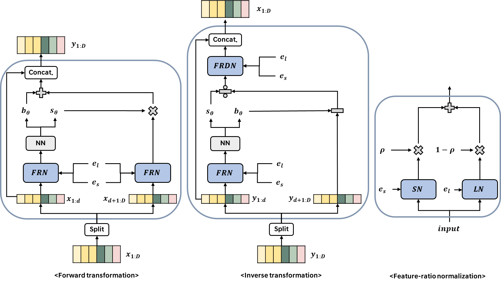

<h2> ClariTTS: Feature-ratio Normalization and Duration Stabilization for Code-mixed Multi-speaker Speech Synthesis </h2>

Submitted to INTERSPEECH 2024 (Paper ID: 608)

<h3>Abstract</h3>

Recent text-to-speech (TTS) models have synthesized remarkably natural speech for code-mixed TTS as well as cross-lingual TTS. However, code-mixed texts are synthesized with unnatural accents for each word because speaker-related features can include linguistic features from the speaker's source language. To solve the problems, we propose ClariTTS, which synthesizes speech with appropriate accents for the language of each word in code-mixed texts. Specifically, we propose feature-ratio normalized affine coupling layer in the flow-based TTS model, which disentangles speaker and linguistic features to prevent the accent of the target speaker's source language from being included in the target language. Furthermore, we introduce a duration stabilization training objectives to ensure stable duration prediction in code-mixed TTS. From the experimental results, we demonstrate that ClariTTS reliably generates code-mixed speech with clear pronunciation while preserving speaker identity.

<h3>Intra-lingual TTS samples</h3>

<table style="margin-left: auto; margin-right: auto;">
    <tr>
        <td>
        	Method
        </td>
        <td class="text">
            
Korean speaker

        </td>
        <td class="text">
            
English speaker

	</td>
    </tr>
    <tr>
        <td class="first-col">Ground truth</td>
        <td>
<audio controls="" preload="none"><source src="./assets/samples/4_gt/1193.wav"></audio>
</td>
        <td>
<audio controls="" preload="none"><source src="./assets/samples/4_gt/8176.wav"></audio>
</td>
    </tr>
    <tr>
        <td class="first-col">Text</td>
        <td class="text">
            
과학자들은 유전학 분야에서 지속적으로   새로운 발견을 하고 있습니다.   (Scientists are constantly making new   discoveries in the field of genetics.)

        </td>
        <td class="text">
            
I prefer tea over coffee.

        </td>
    </tr>
    <tr>
        <td class="first-col">MS-iSTFT-VITS</td>
        <td>
<audio controls="" preload="none"><source src="./assets/samples/1_intra/msvits_aihub_ko_1193_5.wav"></audio>
</td>
        <td>
<audio controls="" preload="none"><source src="./assets/samples/1_intra/msvits_libri_en_8176_24.wav"></audio>
</td>
    </tr>
    <tr>
        <td class="first-col">YourTTS</td>
        <td>
<audio controls="" preload="none"><source src="./assets/samples/1_intra/yourtts_aihub_ko_1193_5.wav"></audio>
</td>
        <td>
<audio controls="" preload="none"><source src="./assets/samples/1_intra/yourtts_libri_en_8176_24.wav"></audio>
</td>
    </tr>
    <tr>
        <td class="first-col">SANE-TTS</td>
        <td>
<audio controls="" preload="none"><source src="./assets/samples/1_intra/sanetts_aihub_ko_1193_5.wav"></audio>
</td>
        <td>
<audio controls="" preload="none"><source src="./assets/samples/1_intra/sanetts_libri_en_8176_24.wav"></audio>
</td>
    </tr>
    <tr>
        <td class="first-col">ClariTTS(Proposed)</td>
        <td>
<audio controls="" preload="none"><source src="./assets/samples/1_intra/durrand_aihub_ko_1193_5.wav"></audio>
</td>
        <td>
<audio controls="" preload="none"><source src="./assets/samples/1_intra/durrand_libri_en_8176_24.wav"></audio>
</td>
    </tr>
    <tr>
        <td class="first-col">w/o cross-speaker   duration loss</td>
        <td>
<audio controls="" preload="none"><source src="./assets/samples/1_intra/attdpspk_aihub_ko_1193_5.wav"></audio>
</td>
        <td>
<audio controls="" preload="none"><source src="./assets/samples/1_intra/attdpspk_libri_en_8176_24.wav"></audio>
</td>
    </tr>
    <tr>
        <td class="first-col">w/o FRN, cross-speaker   duration loss</td>
        <td>
<audio controls="" preload="none"><source src="./assets/samples/1_intra/bdpspk_aihub_ko_1193_5.wav"></audio>
</td>
        <td>
<audio controls="" preload="none"><source src="./assets/samples/1_intra/bdpspk_libri_en_8176_24.wav"></audio>
</td>
    </tr>
</table>

<h3>Cross-lingual TTS samples</h3>

<table style="margin-left: auto; margin-right: auto;">
    <tr>
        <td>
        	Method
        </td>
        <td class="text">
            
Korean speaker

        </td>
        <td class="text">
            
English speaker

	</td>
    </tr>
    <tr>
        <td class="first-col">Ground truth</td>
        <td>
<audio controls="" preload="none"><source src="./assets/samples/4_gt/0002.wav"></audio>
</td>
        <td>
<audio controls="" preload="none"><source src="./assets/samples/4_gt/949.wav"></audio>
</td>
    </tr>
    <tr>
        <td class="first-col">Text</td>
        <td class="text">
            
The traffic is backed up on the highway.

        </td>
        <td class="text">
            
추운 겨울 밤, 가족들이   벽난로 주변에 모였습니다.   (On a cold winter night, families   gathered around the fireplace.)

        </td>
    </tr>
    <tr>
        <td class="first-col">MS-iSTFT-VITS</td>
        <td>
<audio controls="" preload="none"><source src="./assets/samples/2_cross/msvits_aihub_en_0002_53.wav"></audio>
</td>
        <td>
<audio controls="" preload="none"><source src="./assets/samples/2_cross/msvits_libri_ko_949_29.wav"></audio>
</td>
    </tr>
    <tr>
        <td class="first-col">YourTTS</td>
        <td>
<audio controls="" preload="none"><source src="./assets/samples/2_cross/yourtts_aihub_en_0002_53.wav"></audio>
</td>
        <td>
<audio controls="" preload="none"><source src="./assets/samples/2_cross/yourtts_libri_ko_949_29.wav"></audio>
</td>
    </tr>
    <tr>
        <td class="first-col">SANE-TTS</td>
        <td>
<audio controls="" preload="none"><source src="./assets/samples/2_cross/sanetts_aihub_en_0002_53.wav"></audio>
</td>
        <td>
<audio controls="" preload="none"><source src="./assets/samples/2_cross/sanetts_libri_ko_949_29.wav"></audio>
</td>
    </tr>
    <tr>
        <td class="first-col">ClariTTS(Proposed)</td>
        <td>
<audio controls="" preload="none"><source src="./assets/samples/2_cross/durrand_aihub_en_0002_53.wav"></audio>
</td>
        <td>
<audio controls="" preload="none"><source src="./assets/samples/2_cross/durrand_libri_ko_949_29.wav"></audio>
</td>
    </tr>
    <tr>
        <td class="first-col">w/o cross-speaker   duration loss</td>
        <td>
<audio controls="" preload="none"><source src="./assets/samples/2_cross/attdpspk_aihub_en_0002_53.wav"></audio>
</td>
        <td>
<audio controls="" preload="none"><source src="./assets/samples/2_cross/attdpspk_libri_ko_949_29.wav"></audio>
</td>
    </tr>
    <tr>
        <td class="first-col">w/o FRN, cross-speaker   duration loss</td>
        <td>
<audio controls="" preload="none"><source src="./assets/samples/2_cross/bdpspk_aihub_en_0002_53.wav"></audio>
</td>
        <td>
<audio controls="" preload="none"><source src="./assets/samples/2_cross/bdpspk_libri_ko_949_29.wav"></audio>
</td>
    </tr>
</table>

<h3>Code-mixed TTS samples</h3>

<table style="margin-left: auto; margin-right: auto;">
    <tr>
        <td>
        	Method
        </td>
        <td colspan="2">
            
Korean speaker

        </td>
        <td colspan="2">
            
English speaker

	</td>
    </tr>
    <tr>
        <td class="first-col">Ground truth</td>
        <td>
<audio controls="" preload="none"><source src="./assets/samples/4_gt/0002.wav"></audio>
</td>
        <td>
<audio controls="" preload="none"><source src="./assets/samples/4_gt/1193.wav"></audio>
</td>
	<td>
<audio controls="" preload="none"><source src="./assets/samples/4_gt/6741.wav"></audio>
</td>
	<td>
<audio controls="" preload="none"><source src="./assets/samples/4_gt/8176.wav"></audio>
</td>
    </tr>
    <tr>
        <td class="first-col">Text</td>
        <td class="text">
            
음악을 재생할 수 있는 매체로는 Youtube Music,   Apple CarPlay가 있어요.   (Some of the media that can play music include   YouTube Music and Apple CarPlay.)

        </td>
        <td class="text">
            
Americano 한 잔, Black tea 두 잔 주세요.   (One Americano and two Black teas, please.)

        </td>
        <td class="text">
            
Americano 한 잔, Black tea 두 잔 주세요.   (One Americano and two Black teas, please.)

        </td>
        <td class="text">
            
음악을 재생할 수 있는 매체로는 Youtube Music,   Apple CarPlay가 있어요.   (Some of the media that can play music include   YouTube Music and Apple CarPlay.)

        </td>
    </tr>
    <tr>
        <td class="first-col">MS-iSTFT-VITS</td>
        <td>
<audio controls="" preload="none"><source src="./assets/samples/3_mixed/msvits_aihub_bi_0002_9.wav"></audio>
</td>
        <td>
<audio controls="" preload="none"><source src="./assets/samples/3_mixed/msvits_aihub_bi_1193_12.wav"></audio>
</td>
	<td>
<audio controls="" preload="none"><source src="./assets/samples/3_mixed/msvits_libri_bi_6741_12.wav"></audio>
</td>
	<td>
<audio controls="" preload="none"><source src="./assets/samples/3_mixed/msvits_libri_bi_8176_9.wav"></audio>
</td>
    </tr>
    <tr>
        <td class="first-col">YourTTS</td>
        <td>
<audio controls="" preload="none"><source src="./assets/samples/3_mixed/yourtts_aihub_bi_0002_9.wav"></audio>
</td>
        <td>
<audio controls="" preload="none"><source src="./assets/samples/3_mixed/yourtts_aihub_bi_1193_12.wav"></audio>
</td>
        <td>
<audio controls="" preload="none"><source src="./assets/samples/3_mixed/yourtts_libri_bi_6741_12.wav"></audio>
</td>
        <td>
<audio controls="" preload="none"><source src="./assets/samples/3_mixed/yourtts_libri_bi_8176_9.wav"></audio>
</td>
    </tr>
    <tr>
        <td class="first-col">SANE-TTS</td>
        <td>
<audio controls="" preload="none"><source src="./assets/samples/3_mixed/sanetts_aihub_bi_0002_9.wav"></audio>
</td>
        <td>
<audio controls="" preload="none"><source src="./assets/samples/3_mixed/sanetts_aihub_bi_1193_12.wav"></audio>
</td>
        <td>
<audio controls="" preload="none"><source src="./assets/samples/3_mixed/sanetts_libri_bi_6741_12.wav"></audio>
</td>
        <td>
<audio controls="" preload="none"><source src="./assets/samples/3_mixed/sanetts_libri_bi_8176_9.wav"></audio>
</td>
    </tr>
    <tr>
        <td class="first-col">ClariTTS(Proposed)</td>
        <td>
<audio controls="" preload="none"><source src="./assets/samples/3_mixed/durrand_aihub_bi_0002_9.wav"></audio>
</td>
        <td>
<audio controls="" preload="none"><source src="./assets/samples/3_mixed/durrand_aihub_bi_1193_12.wav"></audio>
</td>
        <td>
<audio controls="" preload="none"><source src="./assets/samples/3_mixed/durrand_libri_bi_6741_12.wav"></audio>
</td>
        <td>
<audio controls="" preload="none"><source src="./assets/samples/3_mixed/durrand_libri_bi_8176_9.wav"></audio>
</td>
    </tr>
    <tr>
        <td class="first-col">w/o cross-speaker   duration loss</td>
        <td>
<audio controls="" preload="none"><source src="./assets/samples/3_mixed/attdpspk_aihub_bi_0002_9.wav"></audio>
</td>
        <td>
<audio controls="" preload="none"><source src="./assets/samples/3_mixed/attdpspk_aihub_bi_1193_12.wav"></audio>
</td>
        <td>
<audio controls="" preload="none"><source src="./assets/samples/3_mixed/attdpspk_libri_bi_6741_12.wav"></audio>
</td>
        <td>
<audio controls="" preload="none"><source src="./assets/samples/3_mixed/attdpspk_libri_bi_8176_9.wav"></audio>
</td>
    </tr>
    <tr>
        <td class="first-col">w/o FRN, cross-speaker   duration loss</td>
        <td>
<audio controls="" preload="none"><source src="./assets/samples/3_mixed/bdpspk_aihub_bi_0002_9.wav"></audio>
</td>
        <td>
<audio controls="" preload="none"><source src="./assets/samples/3_mixed/bdpspk_aihub_bi_1193_12.wav"></audio>
</td>
        <td>
<audio controls="" preload="none"><source src="./assets/samples/3_mixed/bdpspk_libri_bi_6741_12.wav"></audio>
</td>
        <td>
<audio controls="" preload="none"><source src="./assets/samples/3_mixed/bdpspk_libri_bi_8176_9.wav"></audio>
</td>
    </tr>
</table>
